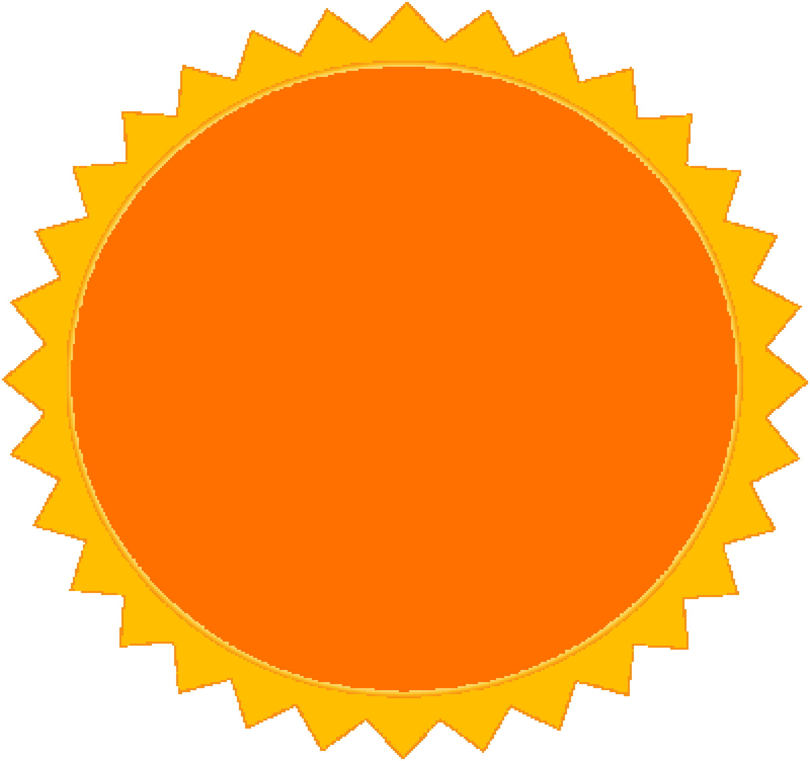
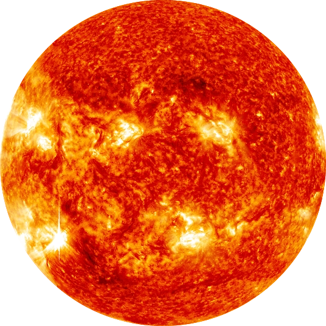

# __First Bootcamp Project__

## Phaser Game

- [__Check it online__](petercatchicecream.surge.sh)

- There are four stages
    1. `Beach`
    1. `Forrest`
    1. `Desert`
    1. `Space`

- You have to maintain your life between 1 - 99
    - Fall to `0` or Reach 100 will both lose

# Reminder

- These increase your health

    
    
    

- These Decrease your health

    
    
    

    __Hitting the sun will slightly increase your health__

- Use `spacebar` to shoot the sun starting from stage 3

# This game supports mobile version as well

# [__Let's play__](petercatchicecream.surge.sh)
